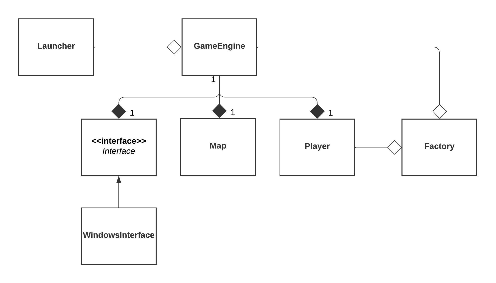
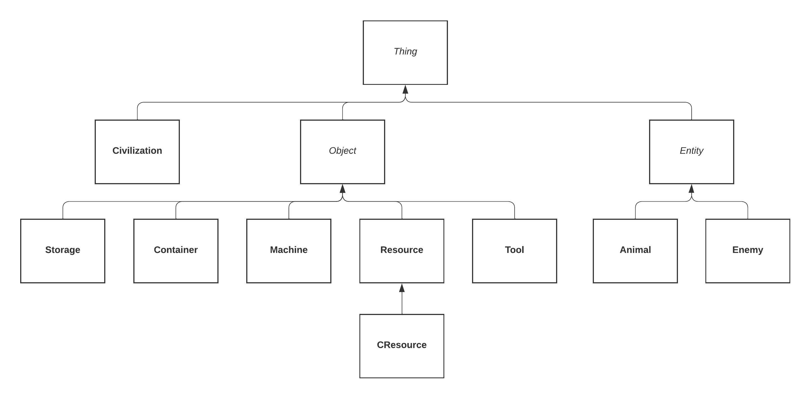

# Adventure 2
 
Adventure-2 is a text-based sandbox adventure game. I began this project to practice C++ design principles, as well as get experience working on a larger project than those I had been exposed to in my courses at UCI. This is the second iteration of this premise by me, the first being written in Python (although it was never as complex as Adventure-2, nor was it actually finished).

## To Play

<u>Note:</u> The game relies on an Interface class to interact with the user. Currently, this is implemented for Windows only. The game is basically playable, but is still in development.

`build.bat` and `run.bat` serve as shortcuts for the terminal commands to build and run the program.

## Code Design

The game is launcher with the **Launcher** class. The launcher creates a **GameEngine** to run the game. The GameEngine takes in an instance of a child class of **Interface** to manage interaction with the user. GameEngine has an instance each of **Player**, **Map**, and **Factory** as attributes. **Player** and **Map** are dependent on the GameEngine instance, but **Factory** is not. The **Player** class also maintains an instance of **Factory** to create objects.

Within the scope of the game, **Thing** serves as the asbtract base class, with 3 direct children, 2 of which are also abstract classes.

A few other classes and function collections exist for utility:
- Colors, ScreenInstructions, StatDefaults, and TextArt define some constant values.
- RandomGenerator and GameData are utility classes used in many parts of the program.
- Formulae, StringHelpers, and FileReader are collections of functions to manage specific types of operations.